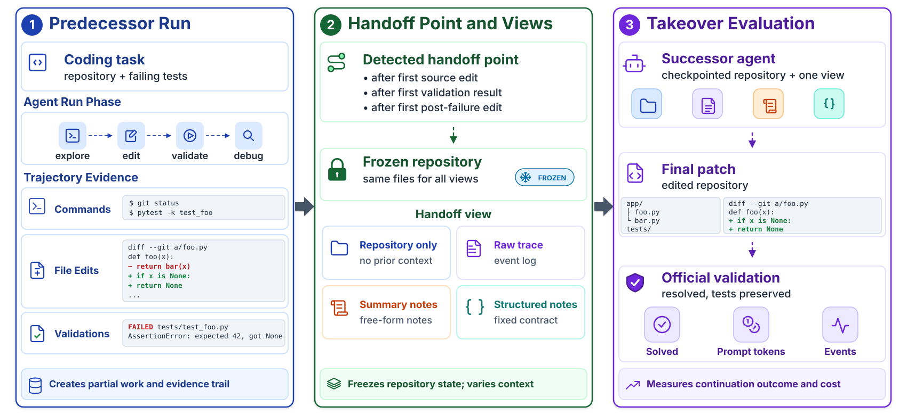

# Handoff Debt

Reference implementation for **Handoff Debt: The Rediscovery Cost When Coding Agents Take Over Interrupted Tasks**, accepted to EMNLP 2026.

Handoff debt is the extra work a successor coding agent performs to understand and resume an interrupted task. This repository provides the experiment harness used to construct frozen handoff points, produce four handoff views, run takeovers, validate outcomes with SWE-bench, and report rediscovery cost.

<p align="center">
  
</p>

## What is included

- The Python harness for initial runs, checkpoints, takeovers, validation, scoring, and reporting.
- Four handoff views: repository only, raw trace, summary notes, and structured notes.
- OpenHands-compatible configurations for Qwen, Gemma, and Devstral.
- The selected 75 SWE-bench Verified task identifiers used in the main experiment.
- The prompt template used for SWE-bench/OpenHands tasks.

The bundled task prompts are derived from the selected SWE-bench Verified instances. See [`THIRD_PARTY_NOTICES.md`](THIRD_PARTY_NOTICES.md).

This release does not include raw model trajectories, Docker workspaces, model-server logs, or full experiment outputs. These artifacts are large and depend on the model endpoint and runtime environment. The harness writes all generated run outputs under `data/`, which is ignored by Git.

## Requirements

- Python 3.12 or 3.13
- [uv](https://docs.astral.sh/uv/)
- Docker with access to the OpenHands agent-server image
- An OpenAI-compatible model endpoint
- SWE-bench testbed images for the tasks you run

Install the package and dependencies:

```bash
uv sync
```

The supplied agent profiles use local endpoints. Override their model endpoint or credentials without editing tracked files:

```bash
export HANDOFF_LLM_BASE_URL="http://localhost:8000/v1"
export HANDOFF_LLM_API_KEY="your-api-key"
export HANDOFF_LLM_MODEL="your-model-id"
```

Check the local environment before an experiment:

```bash
uv run handoff-debt doctor --agent-config configs/agents/qwen.toml
uv run handoff-debt model-smoke --agent-config configs/agents/qwen.toml
```

## Reproducing a takeover

The harness follows this sequence:

1. Run a predecessor on a SWE-bench task.
2. Finalize the run to identify lifecycle checkpoints, validate its state, and prepare handoff material.
3. Start a successor from one frozen checkpoint under one of the four handoff views.
4. Validate and summarize the takeover run.

For a prepared task configuration, an initial run looks like this:

```bash
uv run handoff-debt run-task \
  --task-config configs/tasks/swebench_verified/sphinx-doc__sphinx-8548.toml \
  --agent-config configs/agents/qwen.toml \
  --runs-dir data/runs
```

Finalize its output, replacing the example path with the initial run directory:

```bash
uv run handoff-debt finalize-run \
  --run-dir data/runs/sphinx-doc__sphinx-8548/qwen/initial
```

Then launch a successor from a named handoff point:

```bash
uv run handoff-debt takeover \
  --initial-run data/runs/sphinx-doc__sphinx-8548/qwen/initial \
  --agent-config configs/agents/devstral.toml \
  --handoff-view structured_notes \
  --checkpoint-kind after_first_validation_result \
  --runs-dir data/runs
```

Use `uv run handoff-debt --help` for all available commands and options.

## Task selection and configurations

`selected_075.txt` contains the source-task list used in the main experiment. The matching task configurations are in `configs/tasks/swebench_verified/`.

To download a fresh SWE-bench Verified manifest and generate task configurations:

```bash
uv run handoff-debt fetch-swebench-verified --out data/swebench/verified.jsonl
uv run handoff-debt prepare-swebench \
  --manifest data/swebench/verified.jsonl \
  --instance-id sphinx-doc__sphinx-8548
```

## Repository layout

```text
assets/                 Architecture diagram
configs/                Agent profiles and prepared SWE-bench task configs
src/handoff_debt/       Experiment harness
templates/              SWE-bench/OpenHands prompt template
selected_075.txt        Main-study source-task list
```

## Citation

See [`CITATION.cff`](CITATION.cff). Please cite the EMNLP 2026 paper when using this code or protocol.

## License

This project is released under the [MIT License](LICENSE).
